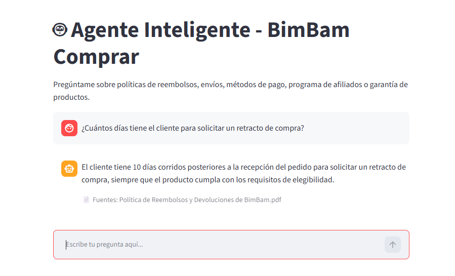

# 🤖 Agente Inteligente - BimBam Buy

Agente de inteligencia artificial que responde preguntas en lenguaje natural 
sobre la documentación interna de **BimBam Buy**, una tienda de e-commerce ficticia, 
desarrollado como proyecto final del Challenge Alura Agente.

## 📋 Descripción del proyecto

Este proyecto resuelve un problema común en empresas de e-commerce: la dificultad 
de encontrar información rápidamente dentro de documentos internos (políticas, 
guías, FAQs). El agente permite hacerle preguntas directas sobre esta documentación 
y recibir respuestas claras, sin tener que leer los documentos completos.

## 🏗️ Arquitectura de la solución

PDFs (docs/) → pypdf (extracción de texto) → LangChain Text Splitter (fragmentación)
- Cohere Embeddings (embed-multilingual-v3.0) → FAISS (base vectorial)
- Retriever (búsqueda semántica) → Cohere Chat (command-a-03-2025) → Respuesta

**Flujo detallado:**
1. `leer_documento.py` extrae el texto de todos los PDFs en `docs/`.
2. El texto se divide en fragmentos de ~1000 caracteres (con solapamiento de 150) usando `RecursiveCharacterTextSplitter`.
3. Cada fragmento se convierte en un embedding con el modelo `embed-multilingual-v3.0` de Cohere.
4. Los embeddings se almacenan en una base vectorial FAISS para búsqueda semántica rápida.
5. Al recibir una pregunta, se buscan los 4 fragmentos más relevantes (retriever).
6. Esos fragmentos se pasan como contexto al modelo `command-a-03-2025` de Cohere, que genera la respuesta final.

## 🛠️ Tecnologías utilizadas

- Python
- LangChain (`langchain-classic`, `langchain-text-splitters`, `langchain-cohere`)
- Cohere (`command-a-03-2025` para chat, `embed-multilingual-v3.0` para embeddings)
- FAISS (base de datos vectorial)
- pypdf (lectura de PDFs)
- python-dotenv (gestión segura de credenciales)

## 📁 Documentación fuente

El agente responde preguntas basadas en 5 documentos de **BimBam Buy** (e-commerce):
- Política de Reembolsos y Devoluciones
- Programa de Afiliados
- Guía de Tiempos y Costos de Envío
- Preguntas Frecuentes sobre Métodos de Pago
- Manual de Garantía de Productos

## ⚙️ Instalación y ejecución

### Requisitos previos
- Python 3.11 o superior
- Una API key de [Cohere](https://cohere.com) (gratuita)

### Pasos

```bash
# Clonar el repositorio
git clone git@github.com:Srodriguez00/Challenge_Alura_Agente_BimBam_Buy.git
cd Challenge_Alura_Agente_BimBam_Buy

# Crear entorno virtual
python -m venv venv
venv\Scripts\activate      # Windows
# source venv/bin/activate   # Linux/Mac

# Instalar dependencias
pip install -r requirements.txt

# Crear archivo .env en la raíz del proyecto con tu API key de Cohere
# COHERE_API_KEY=tu_clave_aqui
```

### Opción 1: Interfaz web (recomendada)

```bash
streamlit run src/app.py
```

Abre automáticamente en tu navegador en `http://localhost:8501`.

### Opción 2: Modo consola

```bash
python src/agente.py
```

Permite hacer preguntas directamente desde la terminal.
## 💬 Ejemplos de uso

**Pregunta:** ¿Cuántos días tiene el cliente para solicitar un retracto de compra?
**Respuesta:** El cliente tiene 10 días corridos posteriores a la recepción del pedido para solicitar un retracto de compra, siempre que el producto cumpla con los requisitos de elegibilidad.
**Fuente:** Política de Reembolsos y Devoluciones de BimBam Buy.pdf

**Pregunta:** ¿Cómo funciona el programa de afiliados?
**Respuesta:** El Programa de Afiliados de BimBam Buy permite a creadores, medios, comunidades y socios comerciales promocionar productos de la marca y recibir una comisión por ventas válidamente atribuidas, mediante seguimiento de enlaces/códigos, liquidación de comisiones y soporte de incidencias.
**Fuente:** Programa de Afiliados de BimBam Buy.pdf

**Pregunta:** ¿Cuánto tiempo tarda un envío estándar?
**Respuesta:** Zonas urbanas principales: 2 a 5 días hábiles. Zonas secundarias: 4 a 8 días hábiles. Zonas de cobertura extendida: 6 a 12 días hábiles, contados desde el despacho al operador logístico.
**Fuente:** Guía de Tiempos y Costos de Envío de BimBam Buy.pdf

**Pregunta:** ¿Qué métodos de pago acepta BimBam Buy?
**Respuesta:** Tarjeta de crédito, tarjeta de débito, transferencia bancaria, pago en efectivo en puntos habilitados, billeteras digitales y cuotas/financiamiento, según el país.
**Fuente:** Preguntas Frecuentes sobre Métodos de Pago de BimBam Buy.pdf

**Pregunta:** ¿Qué cubre la garantía de los productos?
**Respuesta:** Falla de encendido, mal funcionamiento de componentes, defectos de ensamblaje, problemas de fabricación e inconsistencias técnicas no originadas por el cliente, dentro del período de garantía.
**Fuente:** Manual de Garantía de Productos de BimBam Buy.pdf

## ☁️ Deploy

El agente está desplegado en una instancia de cómputo de **Oracle Cloud Infrastructure (OCI)** 
(Ubuntu 20.04, shape VM.Standard.E2.1.Micro, Always Free Tier), con una interfaz web 
construida en **Streamlit**, accesible públicamente en:

🔗 **http://129.158.213.9:8501**

> Nota: la IP es efímera y puede cambiar si la instancia se reinicia. Si el enlace no 
> está disponible, ver la captura de pantalla a continuación como evidencia del deploy funcional.



## 👤 Autor

Srodriguez00
